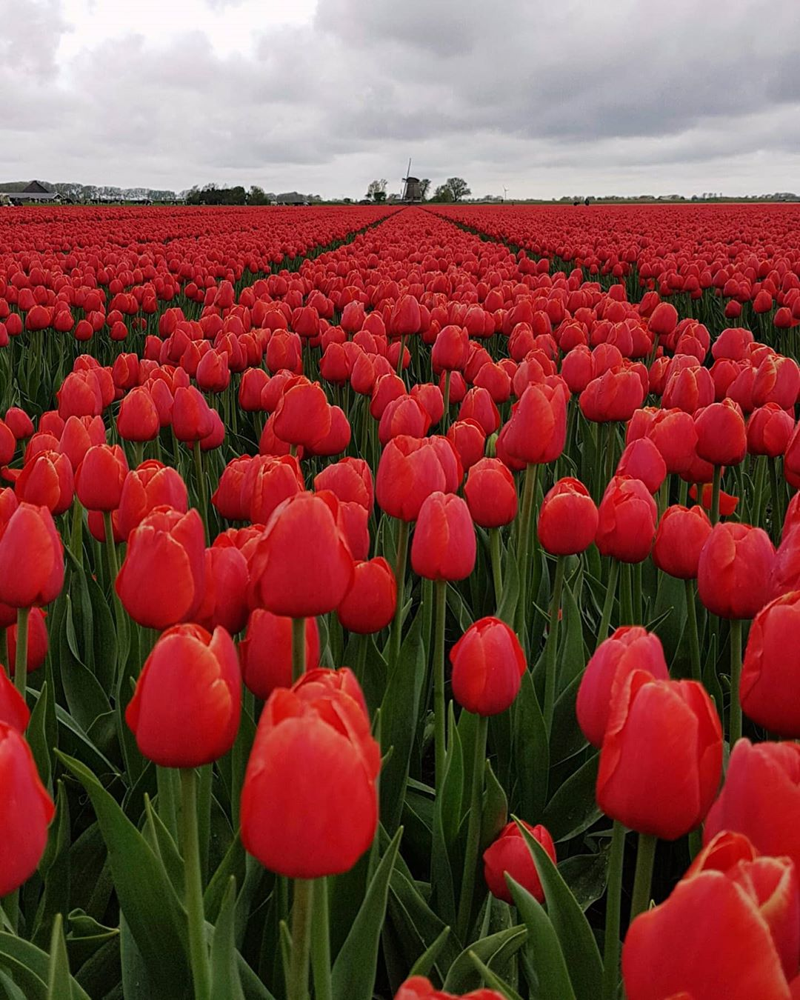
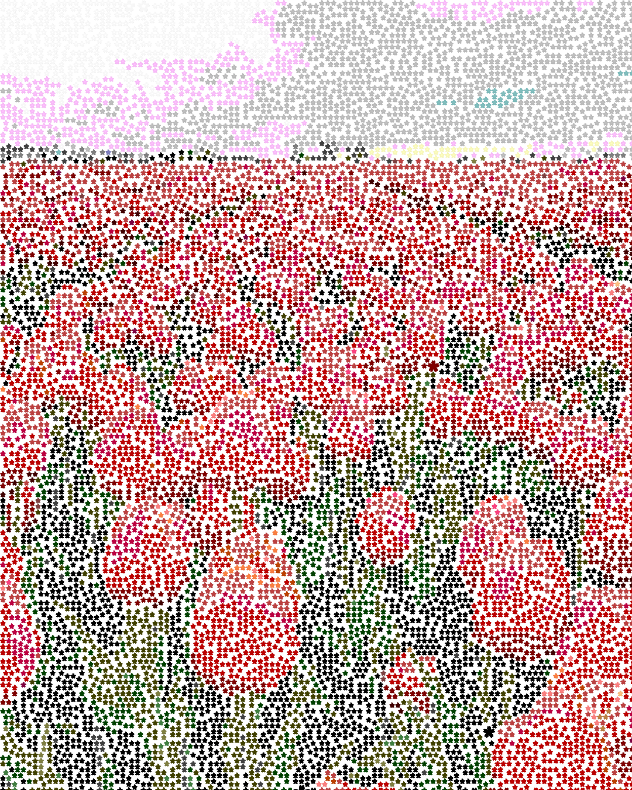
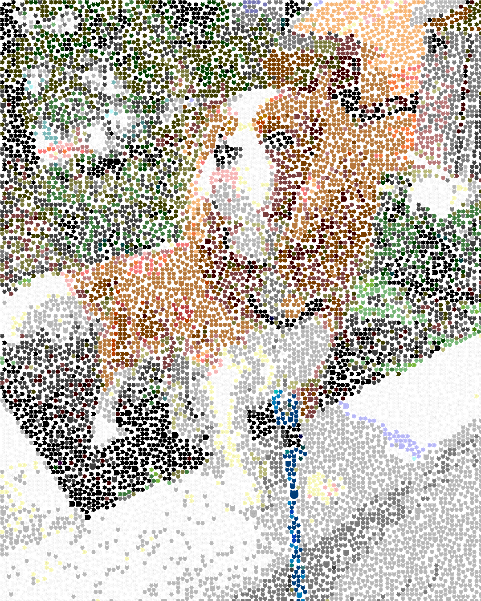
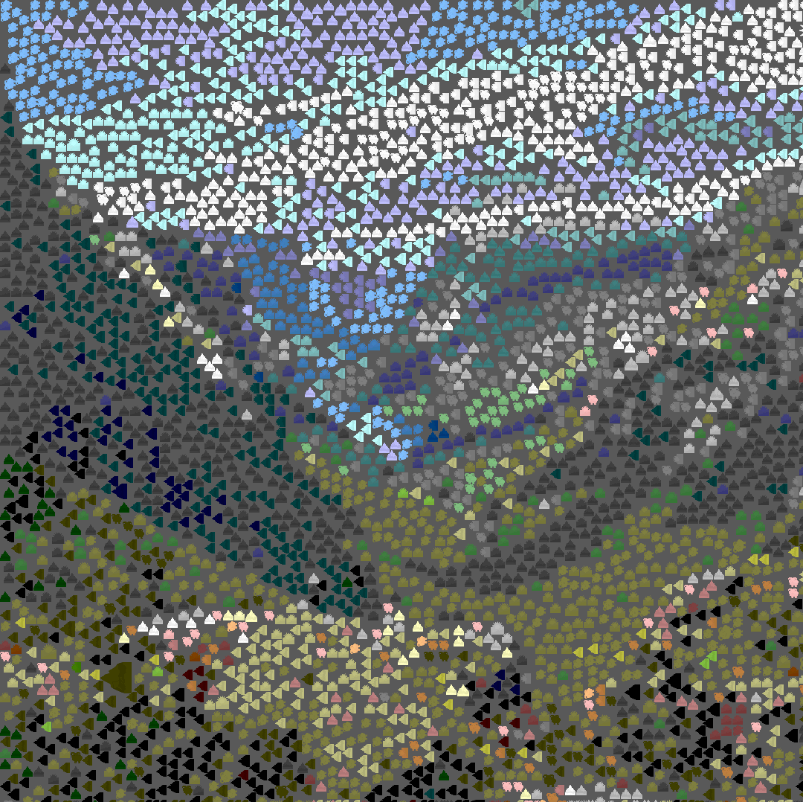

# Image to Emoji Tools

Resources built around some shamelessly ripped-off Stanford undergrad research, Ian Scott Knight and Rayne Hernandez's ["Emoji-Language Image Captioning with Convolutional Neural Networks"](https://github.com/ianscottknight/Emoji-Language-Image-Captioning-with-Convolutional-Neural-Networks).

## 1. Image to Emoji Mosaic:
I tried automating the process of scraping instagram images, selecting emojis that are semantically relevant to those images, then making collages of the original images (made of the semantically relevant emojis):

Image of flowers yields mosaic made of 🌸 🌸 🌸 emojis:

 

Image of dog yields mosaic made of 🐶 🐶 🐶 emojis:

 

Image of valley yields mosaic made of 🐏, 🌄, and 🏔️ emojis:

 

## 2. Image to Emoji API:

A basic API that enables the public to `POST` an image and receive the 5 most semantically relevant emojis as a response.