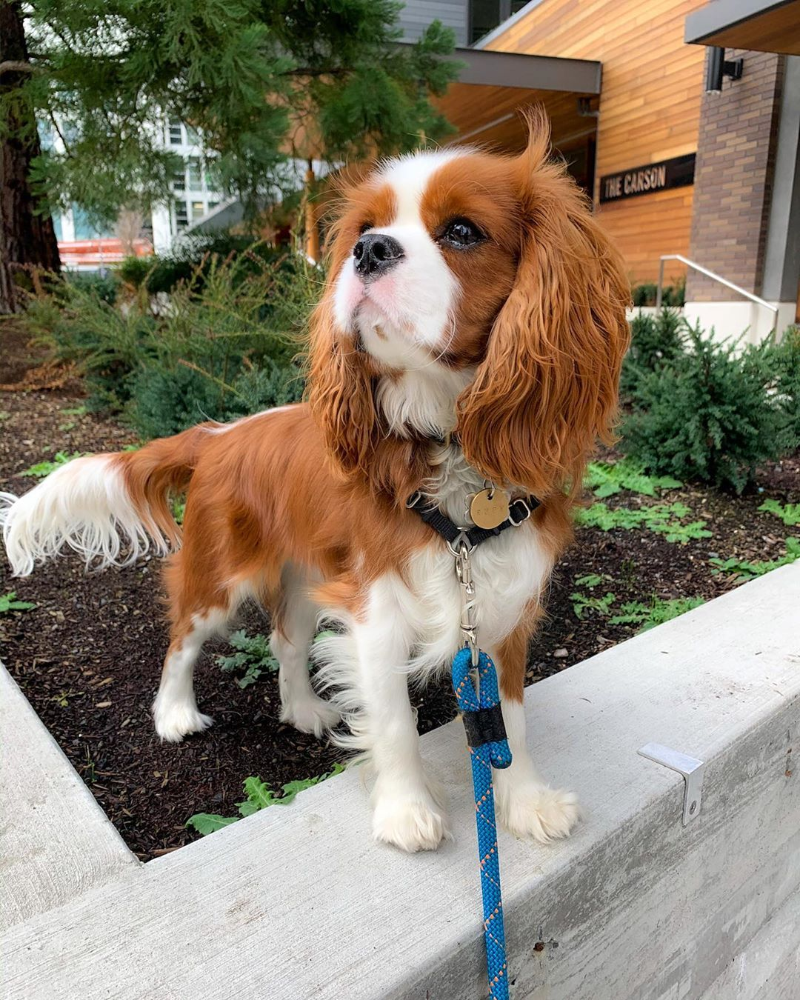
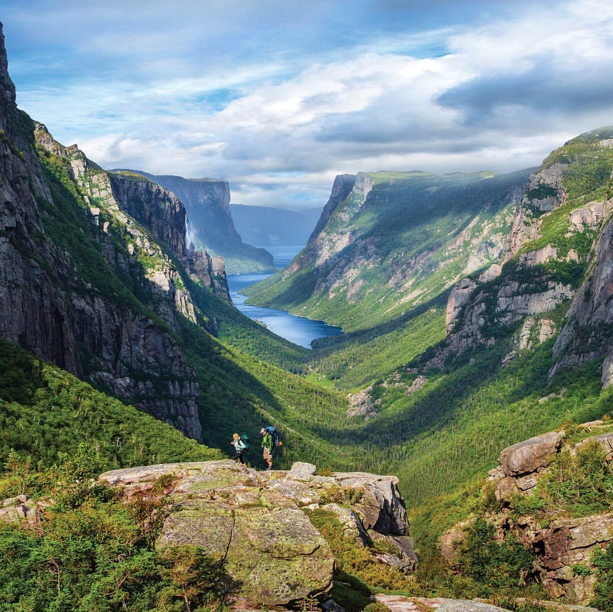

# Instagram Relevant Emoji Tiler

__[Follow on instagram](https://www.instagram.com/image_to_emoji_mosaic/)__

## Summary
Scrapes for instagram images, predicts semantically relevant emojis based on those images, then makes mosaics of the original images—made out of the semantically relevant emojis!

## Examples
The emoji predictor selects the emojis to use as tiles:

Mosaic made of 🌸 🌸 🌸

 

Mosaic made of 🐶 🐶 🐶

 

Mosaic made of 🐏, 🌄, and 🏔️

 

## Components
This is for the most part a remix of disparate pre-existing works:

1. [Rarcega's Instagram Scraper](https://github.com/rarcega/instagram-scraper) is used for pulling down images to emojify and mosaicise. I chose to use instagram as an image sourcing and sharing platform simply because it is so popular and accessible, as opposed to e.g. 500px.

2. I re-trained and re-tooled the image-to-emoji torch model from Ian Scott Knight and Rayne Hernandez's ["Emoji-Language Image Captioning with Convolutional Neural Networks"](https://github.com/ianscottknight/Emoji-Language-Image-Captioning-with-Convolutional-Neural-Networks). In my implementation the torch model accepts single images or image directories (from the scraper) as input, and transforms ASCII emoji prediction outputs into jpegs (with the exact RGB value (240,240,240)) for use as tiles in the next segment:

3. [Nuno Faria's "Tiler"](https://github.com/nuno-faria/tiler) takes images and gray tiles as input, and makes mosaics. It takes some tweaking to achieve a balance between coherent images and legible tiles, i.e. you want to be able to see that the last image above is of mountains but also that it is made of tiny rams and mountains.